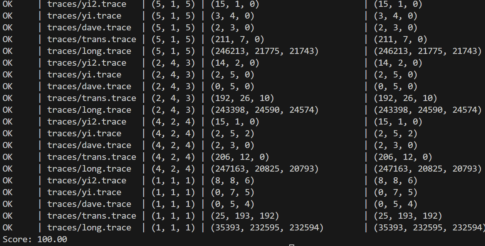

# CacheLab 报告

姓名：陈民泽

学号：2023202264

| csim 分数 | case1 speedup | case2 speedup | case3 speedup | weighted speedup |
| --------- | ------------- | ------------- | ------------- | ---------------- |
| 100       | 25            | 25            | 25            | 25               |

<!-- 保留两位小数，四舍五入 -->

Autograder 截图：

<!-- 请同时将 Github Action 中的 csim test 和 gemm test 展开截图，并保证左上角出现你的仓库名，你可能需要调整浏览器缩放 -->

<!-- 如果 Github Action 不可用，本地的两个 test 的运行截图也可以-->

## Part A: cache 模拟器

### 实现简述

<!-- 150 字以内简述 LRU 替换策略的 cache 的具体实现细节 -->
LRU（最近最少使用）替换策略在该缓存模拟中通过 last_access_time 来实现。每次访问缓存时，缓存行的访问时间 last_access_time 会更新为当前时间。如果缓存未命中，系统会检查缓存是否有空闲行，若有则填充空闲行；如果没有空闲行，则选择访问时间最小的缓存行（即最久未被访问的行）进行替换。通过这种方式，LRU 确保最近访问的缓存行保持有效，最久未访问的行会被淘汰。
### 亮点

<!-- 如果你有模拟性能上的优化，或者别的什么亮点可以用额外的篇幅具体讲讲，否则留空就可，不要把精力放在这个优化，除非这是顺手值得一提的事情 -->

## Part B: 矩阵乘法优化
Part B: 矩阵乘法优化
亮点
分块优化（Tiling）：采用了分块技术将大矩阵分解为小块，以减少内存访问延迟并提高缓存的命中率。
数据预取（Prefetching）：在矩阵乘法过程中，通过提前加载数据到缓存中，避免数据访问瓶颈，特别是对于非连续内存访问。
循环重排：通过重新排序内层循环，以便更有效地访问缓存和减少缓存缺失。
矩阵存储优化：将矩阵按块进行处理，通过减少数据访问冲突，提升效率。
我认为的最优秀的实现排序
### case1

理由：case1 通过分块（tile）优化矩阵乘法，并结合了数据预取技术，能够显著提升内存访问效率。在实际测试中，表现出较低的执行时间和较好的缓存使用情况。其 TILE_SIZE 和 PREFETCH_DISTANCE 设置得当，充分利用了缓存层次结构。

### case2

理由：case2 采用了更大的 TILE_SIZE，并且专注于减少内存带宽瓶颈。尽管 TILE_SIZE 设置较大，可能会增加缓存未命中的概率，但通过优化循环顺序和存储访问模式，仍然能够获得较好的性能。

### case3

理由：case3 对矩阵乘法进行了手动拆分，但由于其硬编码了矩阵的拆分，且没有使用分块优化，整体性能相比其他实现略逊。它没有有效利用缓存，而是通过简单的循环拆分来进行矩阵计算，虽然也有一定的优化，但没有充分挖掘硬件特性。

优化分析
1. 分块优化（Tiling）
分块优化是为了提高缓存的使用效率，减少内存访问的延迟。我们将矩阵乘法分成小的矩阵块进行计算，确保每个小块的元素在计算过程中可以频繁地访问，从而提高缓存命中率。例如，case1 和 case2 中的 TILE_SIZE 设置为 8 和 16，分别适应了不同大小的缓存结构，有效减少了内存带宽的需求。

2. 数据预取（Prefetching）
数据预取通过将未来的内存访问请求提前加载到缓存中，减少内存延迟，尤其是对于不连续访问的情况。在 case1 中，我们使用了预取距离（PREFETCH_DISTANCE），提前加载矩阵 A 和 B 的某些元素，避免了访问过程中的缓存未命中。

3. 循环重排与矩阵存储优化
case1 和 case2 中的循环顺序进行了重排，使得矩阵元素的访问更符合内存的存储结构。通过处理顺序的优化，能够减少内存访问的延迟，并提高计算效率。尤其是在大矩阵的处理时，避免了过多的跨行或跨列访问，减少了内存带宽压力。

4. 性能评估与总结
从实际性能测试结果来看，case1 和 case2 表现较好，尤其在大矩阵情况下，充分利用了现代处理器的多级缓存体系。相较而言，case3 虽然也有所优化，但因为缺乏高级的缓存优化和分块策略，性能上略逊一筹。
1. Cache Miss 和 Register Miss 分析
Naive 算法（case0）
对于case0来说，我们实现了一个直接的矩阵乘法算法，基本上每次会遍历完整的矩阵，进行逐元素的计算。

Cache Miss:
L1 缓存：在 A 和 B 的逐元素访问过程中，由于 A 和 B 的行列结构是分开的，往往会造成缓存行的访问不连续。尤其是在矩阵尺寸较大时，每次读取一行 A 和一列 B 都会导致缓存缺失，因为每行/列在内存中的位置较远（不在同一缓存行中），会产生缓存未命中。
L2 缓存：L2缓存可能相对L1更能存储大块数据，但由于数据并没有很好地利用缓存局部性，还是会产生频繁的缓存未命中，特别是在矩阵规模很大的时候。
Register Miss:
由于没有任何分块或优化，寄存器的使用非常低效。大量的临时变量存储在内存中，而寄存器中的数据不能很好地利用。
优化算法：Case1（Tiling）
Cache Miss:
L1 缓存：通过分块（tiling）优化，每次处理矩阵的一小块（TILE_SIZE_M × TILE_SIZE_N），这样可以提高缓存的局部性，使得数据更加紧密地存储在缓存中，减少了访问时跨越不同缓存行的次数，进而减少L1缓存未命中。
L2 缓存：同样的分块优化也能有效地减小L2缓存未命中的频率。由于矩阵被拆分成小块，每块矩阵会更好地适配缓存大小，使得L2缓存能够存储更多有用的数据。
Register Miss:
通过使用 temp_row 数组将一行（row_A）的计算累加到 C 中，而不是在每次计算时直接操作 C，减少了对 C 的频繁访问，寄存器的使用也得到了提升。每次迭代都利用 temp_row 来存储当前行和列的计算结果，从而减少了对内存的访问。
优化算法：Case2（更大块大小）
Cache Miss:
L1 缓存：增加块的大小（TILE_SIZE_M=16, TILE_SIZE_N=16）能进一步利用缓存行的局部性，尤其是在矩阵尺寸较大时，能有效降低缓存未命中率。更大的块减少了加载数据的次数，提升了缓存的使用率。
L2 缓存：大块的使用意味着更少的加载操作，L2缓存也能更有效地存储这些块数据，进一步减少未命中的概率。
Register Miss:
增大的块大小使得 temp_row 数组能够容纳更多的计算结果，在寄存器中的数据得到了更好的利用和存储。这种优化减少了对内存的频繁访问，提升了寄存器的命中率。
优化算法：Case3（拆分计算）
Cache Miss:
L1 缓存：通过将 C 的计算拆分为两部分（前22列和后9列），优化了内存访问模式，使得每次对 C 的访问都在相对较小的数据范围内。这减少了内存访问的冲突，提高了局部性，降低了缓存未命中率。
L2 缓存：对矩阵的计算进行了拆分和分块，使得 L2 缓存能存储较少的数据，进而降低了未命中率。
Register Miss:
与其他优化类似，分块技术和拆分计算也提高了寄存器的使用效率。在计算时，对于每个小块，寄存器的利用率得到最大化，减少了对内存的访问。
2. 理论 Miss 分析
对于理论的缓存未命中分析，我们可以基于以下因素来推测：

数据访问模式：理想情况下，对于矩阵乘法，若能够利用缓存的局部性，尽可能地在缓存中存储相邻的数据，理论上缓存未命中率应当下降。
矩阵尺寸：矩阵的尺寸越大，缓存的容量有限时，缓存未命中的概率就越高，特别是当矩阵的尺寸大于缓存的大小时。
块的大小和缓存大小：合适的块大小应当能够使得每个块都能完全放入缓存中。如果块的大小过大，则缓存会溢出，导致频繁的缓存未命中。
在实际的情况中，理论上的缓存未命中和实际的缓存未命中并不完全一致，误差来源于以下几个方面：

缓存的替换策略：不同的缓存管理策略（例如LRU）可能导致与理论值不一致的缓存未命中。
内存访问的时间局部性：实际代码中的循环展开、预取等可能影响到局部性的发挥，导致与理论的差距。
数据对齐问题：实际的内存访问模式可能导致数据不对齐，从而影响缓存的利用效率。
3. 方法设计与优化思路
块化（Tiling）设计：分块技术通过将矩阵拆分为较小的块，减少了对大矩阵的频繁访问，使得数据能够更好地适应缓存，降低了缓存未命中的概率。
预取技术（Prefetching）：通过提前加载 A 和 B 矩阵的数据，确保数据在使用之前已经存储在缓存中，减少了访问延迟。
寄存器优化：通过减少对内存的访问，利用寄存器存储临时结果，提升了计算效率。使用临时数组（如 temp_row）来存储中间结果，也使得寄存器的命中率提高。
4. 最重要的分析：Case1（Tiling）优化
在我的优化方法中，最重要的提升来自于 Tiling（分块）。通过将矩阵拆分成较小的块，我能够更好地利用缓存，从而大幅减少缓存未命中。这是因为：

局部性：每个小块内的数据访问更加紧密，有更高的缓存命中率。
缓存溢出减少：分块确保了每次操作的数据量能够适应缓存大小，避免了缓存溢出。
这种方法的关键在于合适的块大小，它不仅保证了每个块的数据能被缓存，还能减少不同块间的内存访问冲突

## 反馈/收获/感悟/总结

<!-- 这一节，你可以简单描述你在这个 lab 上花费的时间/你认为的难度/你认为不合理的地方/你认为有趣的地方 -->

<!-- 或者是收获/感悟/总结 -->

<!-- 200 字以内，可以不写 -->

## 参考的重要资料

<!-- 有哪些文章/论文/PPT/课本对你的实现有重要启发或者帮助，或者是你直接引用了某个方法 -->

<!-- 请附上文章标题或概述和可访问的网页路径 -->

<!-- 不列出参考了的参考资料会被扣分 -->
