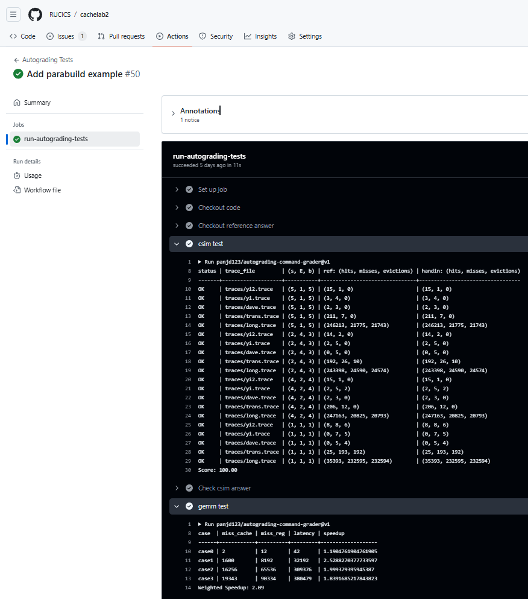

# CacheLab 报告

姓名：张三

学号：2000000000

| csim 分数 | case1 speedup | case2 speedup | case3 speedup | weighted speedup |
| --------- | ------------- | ------------- | ------------- | ----------------- |
| 0.00         | 0.00             | 0.00             | 0.00             | 0.00                 |

<!-- 保留两位小数，四舍五入 -->

Autograder 截图：

<!-- 请同时将 Github Action 中的 csim test 和 gemm test 展开，截图 -->

<!-- 如果 Github Action 不可用，本地的两个 test 的运行截图也可以-->

## Part A: cache 模拟器 实现简述

<!-- 150 字以内简述 LRU 替换策略的 cache 的具体实现细节 -->

<!-- 如果你有模拟性能上的优化可以用额外的篇幅具体讲讲 -->

## Part B: 矩阵乘法优化

<!-- 下文请统一用 "行 * 列" 来表述矩阵形状 -->

<!-- 如果你想用 x, y 或者 i, j 变量来辅助你的表述，
请保证他们的对应关系是 x,y <=> i,j <=> 行,列，不然助教会晕，你们的分数也可能跟着晕，
我指你想说某个单独的矩阵中的 x 行 y 列的时候，不要说 y 行 x 列，
当然有三个矩阵的时候就没这回事了
 -->

### 亮点

<!-- 用最精简且可以被理解的关键词 + 简短的句子，分点描述你所有使用到的优化技巧，如果他们的重要性不同，请按顺序讲 -->

<!-- 比如：1. 分块：xxxx -->

#### 我认为的最优秀的实现排序

<!-- 请排序这三个 case，把你认为的最优秀的实现排在前面 -->

1. case1
2. case2
3. case3

### case0

<!-- 1. 展示你的 cache miss 和 register miss -->

<!-- 2. 分析你的算法的理论 miss，如果和实际不完全相符，误差可能来自于哪里
（通常你的分析不用完全准确，不影响后续你展示算法，或者不同算法性能的大小关系即可） -->

<!-- 3. 你是怎么想到你的方法的，2 和 3 点可以调换顺序或者合并。或者说你的方法有哪些巧妙的设计。 -->

<!-- 4. 我们预计准确分析理论 miss，甚至是大致分析都可能是相当费力的，
此时我们更偏向你挑选一个你最想分享的 case 认真分析，其他 case 可以草率一点。
但这不代表我们只看一个 miss 分析，而是在你精力有限时请把最精华的写出来。
不要费了功夫写了三个分析但每个都浅尝辄止。
大致上我们偏向于看到：
三个都精细分析 > 精细分析一个，潦草分析两个 > 只精细分析一个 > 潦草分析三个
 -->

<!-- 5. 分析 naive 算法的 cache miss 原因，视总篇幅也可以不讲 -->

<!-- 不要贴大段的代码，如果需要贴代码，请一小节一小节，并配合文字解释 -->

<!-- 你可以贴伪代码，或者用注释替代不重要的部分，尽量让报告精简 -->

<!-- 虽然我们分成了 3 节分别对应每个 case，但你不用每次都重复描述共通的思路，你可以修改报告的形式 -->

<!-- 原则上，简单的方法一个 case 所需描述的字数不应超过 500 字，复杂的不应超过 1000 字 -->

<!-- 如果你没有什么优化思路，这一节也可以就讲 naive 算法的 cache miss 的分析 -->

<!-- 如果你的优化思路特别多，请先分点简述一下，如果超出了我们的字数限制，请把最重要的部分在规定字数内先解释清楚，再用”明显的分割线“隔开，再接着写次重要的优化 -->

<!-- 尽量给出你每个优化，或者是渐进的优化中每一步对性能的提升分别是多少 -->

<!-- 如果你有除了脚本算出来的 cache miss 和 register miss 的数据展示，比如你跑了个参数的网格搜索，
请保证这些数据是可复现的，给出复现的代码，和复现代码的执行方法文档。这些应该包含在提交仓库中
-->

### case1

### case2

## 反馈/收获/感悟/总结

<!-- 这一节，你可以简单描述你在这个 lab 上花费的时间/你认为的难度/你认为不合理的地方/你认为有趣的地方 -->

<!-- 或者是收获/感悟/总结 -->

<!-- 200 字以内，可以不写 -->

## 参考的重要资料

<!-- 有哪些文章/论文/PPT/课本对你的实现有重要启发或者帮助，或者是你直接引用了某个方法 -->

<!-- 请附上文章标题和可访问的网页路径 -->

<!-- 不列出参考了的参考资料会被扣分 -->
